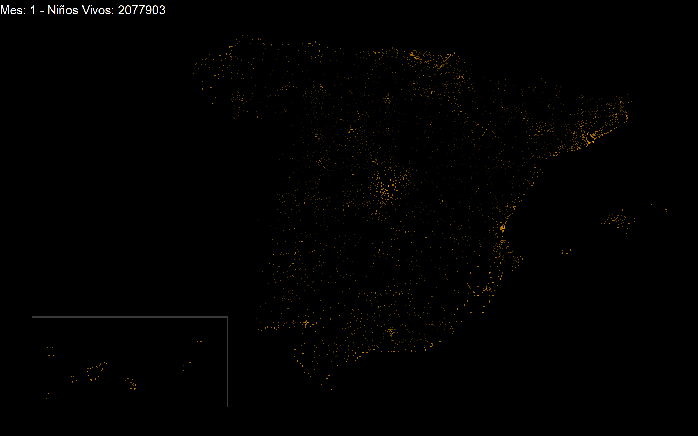

```{r setup, include=FALSE}
knitr::opts_chunk$set(echo = TRUE)
```


## Malnutrition as an avoidable cause of infant mortality
### 

According to NGO [ACTION AGAINST HUNGER](https://www.accioncontraelhambre.org/es/landing/8500-ninos-mueren-cada-dia-por-desnutricion) estimates, **8500 children under the age of 5 die DAILY due to malnutrition**.

This publication aims to create a dynamic map that shows how long it would take for all children under 5 to die in Spain, in case of such a death in our country. This is obviously a figurative exercise, with the sole purpose of facilitating the understanding by the Spanish population of this global tragedy`s scope. In order to reach this goal, a visual metaphor in which the light of the country would go out as children died is used.

***
### The visualization 

**The approximately 2 million Spanish children would DIE IN LESS THAN 9 MONTHS:**




The code and data used in this publication can be downloaded from this [link](https://github.com/GuilleHM/8500).

***
### The code

First, load the necessary libraries:
```{r libraries, results = 'hide', message = FALSE}
if (!require(pacman)) install.packages("pacman") 
p_load("ggplot2", "ggdark", "gganimate", "dplyr", "tidyr", "magrittr", "gifski", "png") 
```

And check that the load was successful:
```{r sessioninfo, collapse=TRUE}
sessionInfo()
```


Then, download the most recent census data (2018) from the [National Institute of Statistics (INE)](https://www.ine.es/). The file, with extension *.px*, can be opened with *PC-Axis* free program and, from there, exported to a *.xlsx* file. Convert the latter to *CSV* format and keep the data related to children aged 0 to 4 years (inclusive). This will be the file with which we will start working:
```{r datosdemograficos}
datos_0a4 <- read.csv2("Datos/Padron/PadronMunicipalContinuoEspaña1Ene2018_0a4años_INE.csv", stringsAsFactors = FALSE, check.names=FALSE)
```


Likewise, download from the INE website, a file (*.mbd*) with the location data of each municipality and export it to a *.xlsx* file. In this file, manipulate the latitude and logitude coordinates for the municipalities of the Canary Islands (adding 6 and 4.5 degrees, respectively), to "bring" the municipalities closer to the peninsula and facilitate the representation of the map. From this file, export both the name and the coordinates of all locations to a *CSV* file. This will be the file we´ll work with:
```{r datosgeograficos}
datos_muni <- read.csv2("Datos/BD_Municipios-Entidades/Municipios_LatLon_ICs_Modificadas.csv", dec = ".", stringsAsFactors = FALSE)
```


A difference of 7 locations between both tables is observed:
```{r comp_num_nuni, collapse = TRUE}
cat("Number of municipalities as per census file:", nrow(datos_0a4) - 1, "\n")
cat("Number of municipalities according to the nomenclator:", nrow(datos_muni))
```


Extract the total number of 0 to 4 years old children in Spain (**around 2 million**):
```{r Num_Total_Niños, collapse = TRUE}
Num_Total_0a4 <- datos_0a4$NumNi_0a4[1]
cat("Total number of 0 to 4 years old children in Spain:", Num_Total_0a4)
datos_0a4 <- datos_0a4[-1,]
```


Join census and nomenclator tables by town:
```{r tabla_datos_final}
datos_final <- merge(datos_0a4, datos_muni, by.x="Localidad")
```


When joining the tables, a loss of data of around 7% is observed (some locations are not represented in any of the two tables):
```{r pérdida_datos, collapse = TRUE}
(Num_Total_0a4 - sum(datos_final$NumNi_0a4)) / sum(datos_final$NumNi_0a4) * 100
```


To compensate for this loss, increase the number of children for each population by that percentage. Highlight here that we allow ourselves to make this adjustment since the purpose of this publication is merely illustrative and it is not essential to discern exactly what population the children belong to:
```{r inclusión_datos, collapse = TRUE}
datos_final$NumNi_0a4 <- as.integer(datos_final$NumNi_0a4 * 1.074)
Num_Total_0a4 <- sum(datos_final$NumNi_0a4)
cat("Total number of 0 to 4 years old children in Spain:", Num_Total_0a4)
```


Calculate in how long all children would die (**less than 9 months**):
```{r Num_dias, collapse = TRUE}
Num_dias <- Num_Total_0a4 / 8500
cat("All children would die in less than:", ceiling(Num_dias / 30.5), "months.")
```


Create a column with the specific weight of each municipality:
```{r Proporcion}
datos_final$prop <- datos_final$NumNi_0a4 / sum(datos_final$NumNi_0a4)
```


Iterate over the table and create a new column for each month (12) with the number of children that would remain alive that month:
```{r Inclusion_dias}
i <- 0
while (i < 12) {
  datos_final[,i+6] <- ifelse(datos_final[,2] - i*(ceiling(datos_final[,5]*8500*30.5)) > 0, datos_final[,2] - i*ceiling((datos_final[,5]*8500*30.5)), 0)
  i<- i + 1
}
```


Remove the "prop" column as it is not longer needed:
```{r Eliminamos_proporcion}
datos_final$prop <- NULL
```


Rename the columns:
```{r Nombre_columnas}
colnames(datos_final)<- c("Localidad", "NumNi_0a4", "Longitud", "Latitud", seq(1, 12, 1))
```


Group the number of children alive for each month:
```{r AgrupamientoPorMes}
datos_final <- datos_final %>%
  gather(key="Mes", value = "Vivos", "1":"12")
datos_final$Mes <- as.integer(datos_final$Mes)
```


Create a new column (Ent), which represents the container in which the number of live children is found at each moment in each population. This categorization is necessary to optimize the visualization, given the great variability of live children (from 150,000 initial children in Madrid, up to 0 children in certain populations). The container division is chosen to match the division in which we distribute the size and transparency of the points in the visualization:
```{r Categorizacion}
datos_final$Bin <- cut(datos_final$Vivos, c(0,10,100,200,500,1000,2000,5000,10000,15000,200000), include.lowest=TRUE)
datos_final$Ent <- as.integer(as.factor(datos_final$Bin))
```


Pass the number of alive children on a logarithmic scale and normalize the result. We use these two columns for the size and transparency of the map points, respectively:
```{r Normalizacion}
datos_final$Vivos <- ifelse(datos_final$Vivos > 0, round(log(datos_final$Vivos),1), 0)
datos_final$Norm <- datos_final$Vivos / max(datos_final$Vivos)
```


Modify the transparency values of the points to facilitate a smoother transition between the different months. This parameterization is the result of several iterations adjusting the size and transparency values of the points:
```{r TransicionVisual}
datos_final[(datos_final$Mes == 9 & datos_final$Ent <= 4), 9] <- 0
datos_final[(datos_final$Mes == 8 & datos_final$Ent <= 3), 9] <- 0
datos_final[(datos_final$Mes == 7 & datos_final$Ent <= 3), 9] <- 0
datos_final[(datos_final$Mes == 6 & datos_final$Ent <= 2), 9] <- 0
datos_final[(datos_final$Mes == 5 & datos_final$Ent <= 2), 9] <- 0
datos_final[(datos_final$Mes == 4 & datos_final$Ent <= 1), 9] <- 0
```


Finally, create the animated map and save it to file:
```{r Mapa, warning=FALSE, message=FALSE, results='hide'}
anim <- ggplot(datos_final) +
  geom_point(mapping = aes(x = Longitud, y = Latitud, size = Vivos, alpha = Norm), shape = 16, show.legend = FALSE, color = "orange") +
  dark_theme_void(base_size = 30, base_family = "times") +
  #Separadores Islas Canarias
  geom_segment(aes(x = -8.3, y = 35.5, xend = -8.3, yend = 37.5), size = 1.5, color = "#3b3838") +
  geom_segment(aes(x = -13.9, y = 37.5, xend = -8.28, yend = 37.5), size = 1.5, color = "#3b3838") +
  scale_size_continuous(range = c(-1, 2), breaks = seq(0, 11, 1)) +
  scale_alpha(range = c(0, 1), breaks = seq(0, 1, 0.1)) +
  labs(title = '  Month: {frame_time} - Alive Children: {ifelse((Num_Total_0a4 - floor((frame_time - 1) * 8500 *30.5)) > 0, Num_Total_0a4 - floor((frame_time - 1) * 8500 *30.5), 0)}') +
  transition_time(Mes) +
  exit_fade() +
  ease_aes('linear')

animate(anim, height = 1280, width = 2048, fps = 5)
anim_save("Animacion_Final.gif")
```


***
## If this code has been useful to you in any way, please consider making a donation to help alleviate this heartbreaking reality. THANKS!
###


**NOTE:** This post`s author has created it in good faith, for informative purposes, and does not have any commercial or labor relationship with the NGO [ACTION AGAINST HUNGER](https://www.actionagainsthunger.org.uk/).


